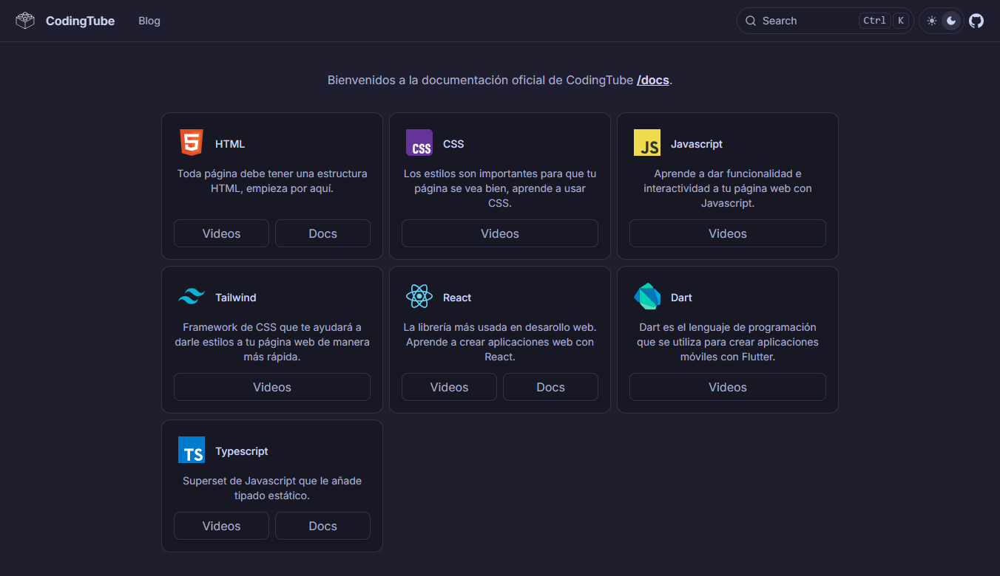

# CodingTube Docs

This repository serves as comprehensive documentation for web development courses offered on the [CodingTube YouTube channel](https://www.youtube.com/CodingTube) . It provides well-structured resources, examples, and guides to complement the learning experience, helping developers of all levels deepen their skills in web development.



## Live site

You can view the live site here: [codingtube.dev](https://www.youtube.com/CodingTube)

## Website

The main technologies used in this project are:

- Markdown
- Next.js
- TypeScript
- Fumadocs

## Installation

This project uses [Next.js](https://nextjs.org/) and [pnpm](https://pnpm.io/) for dependency management.

## Prerequisites
- Node.js >= 18
- pnpm installed globally (`npm install -g pnpm`)

## Installation

1. Install dependencies:
   ```bash
   pnpm install
   ```

2. Start the development server:
   ```bash
   pnpm dev
   ```

1. Static Build:
   ```bash
   pnpm build
   ```

3. Serve the static build:
   ```bash
   pnpx serve@latest out
   ```

## Author

David Ruiz - Frontend Developer
- [Github](https://github.com/Davichobits)
- [Frontend Mentor](https://www.frontendmentor.io/profile/Davichobits) 
- [Linkedin](https://www.linkedin.com/in/davidirc/)
- [YouTube](https://www.youtube.com/CodingTube)
- [codingtube.dev](https://codingtube.dev/)

## GitAds Sponsored
[](https://gitads.dev/v1/ad-track?source=davichobits/davichobits@github)

