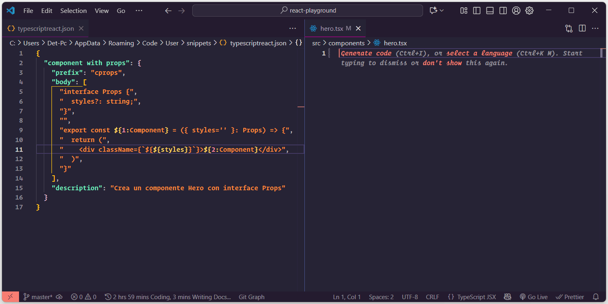

Los snippets son una herramienta poderosa que puede aumentar significativamente tu productividad al programar. En este artículo aprenderás qué son, por qué son útiles y cómo crear tus propios snippets personalizados en VS Code.

## ¿Qué son los snippets?

Un snippet es un fragmento de código reutilizable que puedes insertar rápidamente mediante una abreviatura. Por ejemplo, al escribir `cprops` en tu editor, Visual Studio Code puede autocompletar automáticamente toda la estructura de un componente de React.

Esta funcionalidad te permite ahorrar tiempo al evitar escribir repetidamente el mismo código. En lugar de teclear línea por línea, simplemente escribes una abreviatura corta y obtienes la estructura completa en segundos.

## Ventajas de usar snippets

- **Ahorro de tiempo**: Escribe código repetitivo en segundos
- **Consistencia**: Mantén un estilo de código uniforme en todo tu proyecto
- **Menos errores**: Reduce los errores tipográficos al automatizar el código común
- **Mayor productividad**: Enfócate en la lógica en lugar de la sintaxis básica

## Guía paso a paso para crear un snippet

### Paso 1: Acceder a la configuración de snippets

En Visual Studio Code, navega a la siguiente ruta:

**Archivo > Preferencias > Configurar Snippets**

### Paso 2: Seleccionar el tipo de archivo

Aparecerá una ventana donde debes especificar el tipo de archivo para el cual deseas crear el snippet. Puedes crear snippets para diferentes lenguajes como HTML, CSS, JavaScript, TypeScript, etc.

Para nuestro ejemplo, crearemos un snippet para componentes de React, por lo que escribiremos **TypeScript JSX**. Es importante elegir la variante JSX si trabajas con React.

### Paso 3: Definir la estructura básica del snippet

Al completar el paso anterior, se abrirá un archivo con extensión `.json`. Aquí definiremos la estructura de nuestro snippet con el siguiente formato:

```json
{
  "nombre_del_snippet": {
    "prefix": "cprops",
    "body": [],
    "description": "Crea un componente React con interface Props"
  }
}
```

Cada propiedad cumple una función específica:

- **nombre_del_snippet**: Un identificador único para tu snippet (puede ser cualquier nombre descriptivo)
- **prefix**: La abreviatura que escribirás para invocar el snippet (en este caso `cprops`)
- **body**: Un array que contendrá las líneas de código del snippet
- **description**: Una breve descripción de lo que hace el snippet

### Paso 4: Agregar el código del snippet

Ahora viene la parte más importante: agregar el código que queremos generar. Como trabajamos en un archivo JSON, debemos seguir su formato específico.

Supongamos que queremos crear el siguiente componente de React:

```tsx
interface Props {
  styles?: string;
}

export const Component = ({ styles='' }: Props) => {
  return (
    <div className={`${styles}`}>Component</div>
  )
}
```

Para convertirlo en un snippet, debemos formatear cada línea como un string dentro del array `body`:

```json
{
  "component with props": {
    "prefix": "cprops",
    "body": [
      "interface Props {",
      "  styles?: string;",
      "}",
      "",
      "export const ${1:Component} = ({ styles='' }: Props) => {",
      "  return (",
      "    <div className={`${${styles}}`}>${2:Component}</div>",
      "  )",
      "}"
    ],
    "description": "Crea un componente React con interface Props"
  }
}
```

**Puntos clave a tener en cuenta:**

- Cada línea de código va entre comillas dobles
- Cada línea termina con una coma (excepto la última)
- Las líneas vacías se representan con `""`
- Los espacios y la indentación deben escribirse explícitamente

### Variables y puntos de edición

Observa los elementos `${1:Component}` y `${2:Component}` en el snippet. Estos son **tabstops** que permiten navegar rápidamente entre los puntos que necesitas personalizar:

- `${1:Component}`: Primera posición del cursor con valor predeterminado "Component"
- `${2:Component}`: Segunda posición al presionar Tab

Esto hace que tu snippet sea interactivo y fácil de personalizar después de insertarlo.

## Resultado final

Una vez configurado tu snippet, al escribir `cprops` en cualquier archivo `.tsx` y presionar Enter o Tab, Visual Studio Code generará automáticamente toda la estructura del componente.



## Conclusión

Los snippets personalizados son una excelente manera de optimizar tu flujo de trabajo en Visual Studio Code. Con un poco de configuración inicial, puedes crear atajos para cualquier patrón de código que uses frecuentemente, haciendo que tu proceso de desarrollo sea más ágil y eficiente.