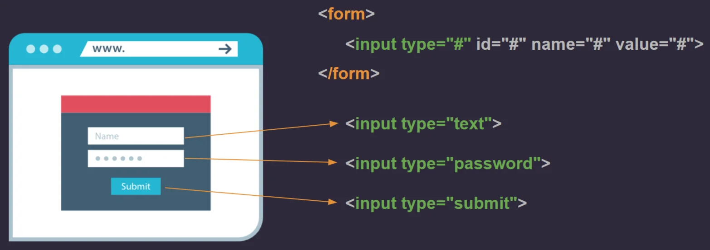

Para crear un formulario en HTML, hay que utilizar la etiqueta `form`. Opcionalmente puedes utilizar el atributo `action` para indicar la dirección donde enviar los datos del formulario. Por ejemplo:

```html
<form action="https://example.com/form.php">
  <label for="name">Name:</label>
  <input type="text" id="name" name="name" />
  <input type="submit" value="Submit" />
</form>
```

El código anterior genera el siguiente formulario:


Dentro del la etiqueta form podemos ver dos etiquetas más:

- `<label>`: Genera un título, en este caso está creando el título "Name:" y se lo está asignando a la etiqueta `input` através del atributo `for`.
- `<input>`: Crea una forma de ingresar información para el usuario. Si el input es tipo "text" se crea un campo de texto. Si es tipo "submit" se crea un botón.

## Tipos de input

La etiqueta input puede tener varios tipos de input, entre los más conocidos se tiene los siguientes:

- `text`: Crea un campo de texto.
- `checkbox`: Crea un cuadro de verificación.
- `radio`: Crea un grupo de botones de radio.
- `number`: Crea un campo de entrada de números.
- `submit`: Crea un botón de enviar.
- `password`: Crea un campo de contraseñas.
- `date`: Crea un campo de fecha.
- `time`: Crea un campo de tiempo.
- `range`: Crea un campo de rango.
- `file`: Crea un campo de archivo.
- `color`: Crea un campo de color.
- `image`: Crea un campo de imagen.
- `email`: Crea un campo de correo electronico.
- `url`: Crea un campo de URL.
- `tel`: Crea un campo de telefono.
- `search`: Crea un campo de busqueda.

Cada uno de los tipos anteriores genera un input diferente. Por ejemplo, si el tipo es "submit" genera un botón, como en el ejemplo anterior, y si es tipo "password" genera un campo para ingresar una contraseña (de esos que en vez de mostrar el texto, muestra una serie de puntos \*\*\*\*).

## Ejemplo de formulario de login.

En la siguiente imagen podrás ver de una forma más gráfica algunos de los tipos de input más utilizados para generar un formulario.



<Callout title="Tip" type="warn">
Te recomiendo ir probando cada uno de los tipos de input para que conoscas su funcionamiento y te vayas familiarizando con ellos. Pero si quieres ver un ejemplo de cada uno de ellos, puedes ver el siguiente video.
</Callout>

# Te explico cómo crear formularios en HTML paso a paso aquí:

<iframe width="100%" height="444" src="https://www.youtube.com/embed/cX7Pml5ZM84?si=dNkZsGmm_Qb5RYNN" title="YouTube video player" frameBorder="0" allow="accelerometer; autoplay; clipboard-write; encrypted-media; gyroscope; picture-in-picture; web-share" allowFullScreen></iframe>
