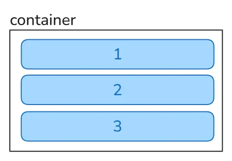
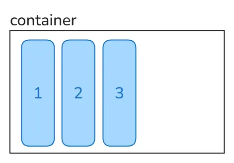

Flexbox te permite posicionar elementos de forma dinámica desde un elemento padre. Imagina que tienes el siguiente código:

```html
  <div class="container">
    <div class="item">1</div>
    <div class="item">2</div>
    <div class="item">3</div>
  </div>
```

El elemento *padre* será el `div` que tiene la clases `container`.

Por defecto, los elementos hijos (los que tienen la clase item) se posicionarán uno debajo del otro:



## display: flex

Para hacer que sus elementos hijos se distribuyan en una fila, debes aplicar las siguientes propiedades CSS al contenedor:

```css
.container {
  display: flex;
}
```

Esto cambiará el comportamiento de los elementos hijos, colocándolos en una fila en lugar de en una columna:



## justify-content

También podemos modificar su posición desde aquí con la propiedad `justify-content`. Por ejemplo, si queremos que los elementos se distribuyan uniformemente en el espacio disponible, podemos usar:

```css
.container {
  justify-content: space-between;
}
```
Esto agregará un espacio entre los elementos hijos, distribuyéndolos uniformemente en la fila:


# Más propiedades

Flexbox nos permite modificar la posición de los elementos de muchas formas más, las mismas que te explico a detalle en el siguiente video:

<iframe className='youtube-video' src="https://www.youtube.com/embed/u1iI_pNHFS8?si=JWLhjFXrav_-VNUj" title="YouTube video player" frameBorder="0" allow="accelerometer; autoplay; clipboard-write; encrypted-media; gyroscope; picture-in-picture; web-share" referrerPolicy="strict-origin-when-cross-origin" allowFullScreen></iframe>