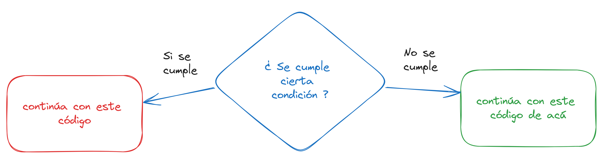

import {
  Building,
  Rocket
} from 'lucide-react';

Un condicional en programación, es un bloque de código te permite realizar una operación dependiendo de una condición. 



El condicional `if` evalúa si una condición se cumple o no. Su sintaxis es la siguiente:

```dart
  if (condición) {
    // hacer algo
  }
```

Como puedes ver, se utiliza la palabra reservada `if` y entre paréntesis se coloca la condición. Esta condición puede ser cualquiera. Como por ejemplo preguntar si `a > b` conociendo de antemanos los valores:

```dart
  int a = 10;
  int b = 5;

  if (a > b) {
    // hacer algo
  }
```

Ten en cuenta que la "condición" es una expresión que arroja como resultado un valor booleano. Es decir su resultado puede ser `true` o `false`.

Si la condición se cumple (cuando es `true`), entonces se ejecuta lo que está dentro de las llaves. Si no se cumple, simplemente omite lo que está entre llaves.

## Ejemplo de uso

Imagina que quieres imprimir en consola si una persona es mayor de edad o no (teniendo en cuenta que el criterio para saber si una persona es mayor de edad es que tenga 18 o más años).

Podríamos hacer lo siguiente:

```dart
void main() {

  int edad = 20;  // declaramos una variable con un valor inicial

  if(edad >= 18){ // Preguntamos si la edad es mayor o igual a 18

    print('Es mayor de edad'); // Como si se cumple la condición, imprimimos el mensaje

  }

}
```

## La palabra reservada `else`

Que sucede si no se cumple la condición, y queremos imprimir otro mensaje como "Es menor de edad". Podemos hacerlo de la siguiente forma:

```dart
void main() {

  int edad = 13;  // Esta vez declaramos la variable con un valor de 13

  if(edad >= 18){ 

    print('Es mayor de edad'); // Como NO se cumple la condición, NO se imprime este mensaje

  } else {

    print('Es menor de edad'); // Como SI se cumple la condición, SI se imprime este mensaje

  }
}
```

<Callout title="Importante" type="error">
Fíjate que ahora hay una nueva palabra reservada `else` (significa "caso contrario" en español) que nos permite especificar lo que se hará si la condición no se cumple.
</Callout>

## El condicional `else if`

Puede darse el caso de que quieres hacer una nueva condición en caso de que la primera no se cumple. Puedes usar un nuevo `if` o lo que se hace comúnmente es utilizar el condicional `else if`. De la siguiente forma:

```dart
  if (condición1) {
      // Código que se ejecuta si condición1 es verdadera
  } else if (condición2) {
      // Código que se ejecuta si condición1 es falsa y condición2 es verdadera
  } else {
      // Código que se ejecuta si todas las condiciones anteriores son falsas
  }
```

Por ejemplo se lo puede usar así:

```dart
void main() {
  int numero = 0;

  if (numero > 0) {  // Se pregunta si se cumple una primera condición
    print("El número es positivo");
  } else if (numero < 0) { // caso contrario se pregunta por una segunda condición
    print("El número es negativo");
  } else { // Si no se cumple ninguna  de las anteriores
    print("El número es cero");
  }
}
```

## Ejercicio propuesto:

Es hora de poner en práctica lo que has aprendido en este post. A continuación, en la pestaña `Ejercicio` tienes un ejercicio propuesto. La idea es que trates de hacerlo por tu cuenta y luego lo puedas comprobar con la solución sugerida de la pestaña `Respuesta`

```ts tab="<Building /> Ejercicio"
    // Escribe un programa en Dart que simule el comportamiento de un semáforo. 
    // El programa debe recibir un color de semáforo (rojo, amarillo o verde) 
    // como entrada, y mostrar un mensaje dependiendo del color:

    //* Si el color es **rojo**, mostrar: *"Debes detenerte"*.
    //* Si el color es **amarillo**, mostrar: *"Prepárate para detenerte"*.
    //* Si el color es **verde**, mostrar: *"Puedes continuar"*.
    //* Si el color no es ninguno de los anteriores, mostrar: *"Color no válido"*.

    void main() {

      // Puedes cambiar este valor por "rojo", "amarillo", o cualquier otro para probar
      final String colorSemaforo = "verde"; 

      // tu código va aquí

    }
    
```
```ts tab="<Rocket /> Respuesta"
    
    // Gracias por haberlo intentado primero antes de ver la solución.
    // Si no lo hiciste así, cambia de pestaña e inténtalo tu primero 🤭 
    
    // Recuerda que no hay una solución única. 
    // Toma la siguiente solución como una sugerencia de cómo se pudo 
    // hacer resuelto el ejercicio.
    
    void main() {
      final String colorSemaforo = "verde";

      if (colorSemaforo == "rojo") {
        print("Debes detenerte");
      } else if (colorSemaforo == "amarillo") {
        print("Prepárate para detenerte");
      } else if (colorSemaforo == "verde") {
        print("Puedes continuar");
      } else {
        print("Color no válido");
      }
    }
    
```

## Explicación en video:

A continuación te dejo un video donde te explico cómo utilizar el condicional `if`:

<iframe width="100%" height="444" src="https://www.youtube.com/embed/nq4A5Yom4SM?si=FCrn2eoP1GlLFbcu" title="YouTube video player" frameBorder="0" allow="accelerometer; autoplay; clipboard-write; encrypted-media; gyroscope; picture-in-picture; web-share" referrerPolicy="strict-origin-when-cross-origin" allowFullScreen></iframe>