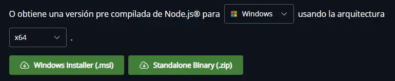
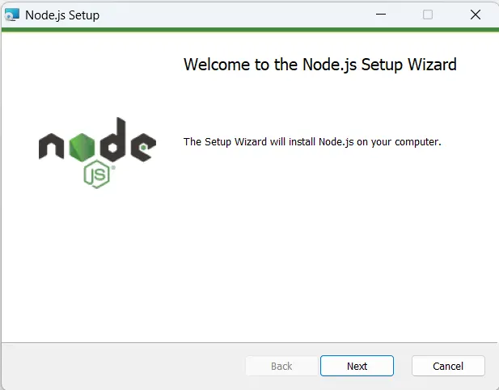
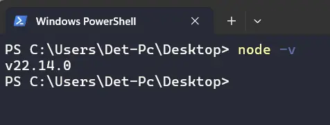

Antes de instalar Typescript en tu computador, es necesario tener instalado [Node](https://nodejs.org/es/).

## 1. Instalación de Node

Para hacer la instalacion de Node, es necesario descargar el paquete de instalación desde [aquí](https://nodejs.org/es/download). 

En esta página podrás elegir el sistema operativo con el que trabajas, ya se Windows, Linux, o MacOS.



La instalación es bastante sencilla. Solamente es necesario seguir la instrucciones del instalador:



Una vez que el proceso se haya finalizado, puedes comprobar que Node está correctamente instalado de la siguiente forma:

1. Abre una terminal en cualquier directorio.
2. Escribe el siguiente comando, el mismo que mostrará la versión de Node instalada en tu computador.

```sh
node -v
```

Si tienes un resultado como el siguiente, quiere decir la que la instalación se realizó con éxito:



<Callout>

Algunas veces, la instalación de Node requiere que se reinicie el computador. Si al ejecutar el código anterior aún no vez la versión de Node, te recomiendo reiniciar el computador.

</Callout>

Ahora que ya tiene node instalado podrás instalar Typescript usando NPM (Node package Manager) de la siguiente forma:


## 2. Instalación de Typescript

Instalar Typescript es muy sencillo. En tu terminal deberás escribir el siguiente comando:

```sh
npm i typescript -g
```

A continuación desgloso lo que escribimos en la línea anterior:

- *npm* Gestor de Paquetes de Node.
- *i* instalar.
- *-g* de forma global en nuestro computador.

Con esto ya tienes instalado Typescript en tu computador y puedes empezar a trabajar.

## Explicación en Video

Si quieres aprender más sobre Typescript te recomiendo ver el siguiente video:

<iframe className='youtube-video' src="https://www.youtube.com/embed/8MbXrRwd0lY?si=FRK83bpp2HRHMwlD" title="YouTube video player" frameBorder="0" allow="accelerometer; autoplay; clipboard-write; encrypted-media; gyroscope; picture-in-picture; web-share" referrerPolicy="strict-origin-when-cross-origin" allowFullScreen></iframe>